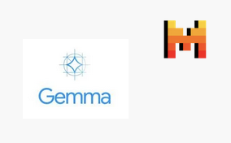
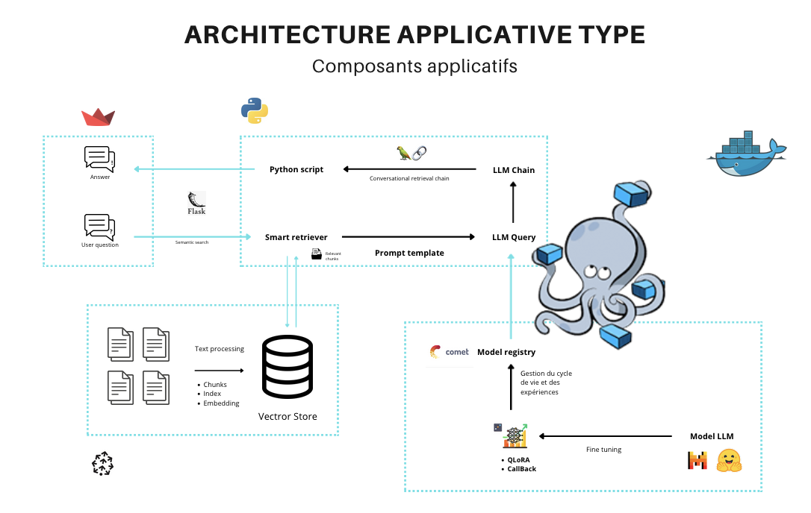

# Projet Text-to-Code : Workflow LLMOps

Bienvenue dans le projet Text-to-Code, une initiative axée sur le développement d'un workflow robuste de LLMOps (Large Language Model Operations). Ce projet vise à exploiter les grands modèles de langage pour générer automatiquement du code Python pour l'analyse graphique à partir de saisies en langage naturel.

 <!-- Ajoutez le logo de votre projet ici -->

## Aperçu du Projet

Ce projet est un générateur de code Python pour l'analyse graphique. Il prend un fichier (comme un fichier CSV ou Excel) en entrée et effectue des analyses graphiques basées sur des requêtes en langage naturel fournies par l'utilisateur. Le cœur du projet est un grand modèle de langage (LLM) finement ajusté, spécifiquement Mistral, conçu pour comprendre et générer du code Python pour l'analyse des données.

 <!-- Ajoutez une image de l'aperçu du projet -->

## Fonctionnalités

- **Grand Modèle de Langage (LLM) Finement Ajusté** : Utilisation de Mistral, un grand modèle de langage finement ajusté sur des données Python pour générer un code Python précis et efficace pour les tâches d'analyse de données.
- **Fonctionnalité de Text-to-Code** : Permet aux utilisateurs d'entrer des requêtes en langage naturel pour générer des scripts Python qui effectuent des analyses de données et des visualisations spécifiques.
- **RAG (Génération Augmentée par Récupération)** : Utilise une base de données vectorielle pour une génération augmentée par récupération, améliorant la capacité du modèle à fournir des extraits de code pertinents et contextuels.
- **Interface Streamlit** : Une interface conviviale pour interagir avec le modèle, télécharger des fichiers, saisir des requêtes et visualiser les résultats.
- **Environnement Dockerisé** : Le projet fonctionne dans un environnement conteneurisé, garantissant une configuration et un déploiement faciles.

## Technologies Utilisées

Le projet utilise plusieurs technologies avancées pour atteindre ses objectifs :

- **Hugging Face** : Utilisé pour les datasets et les modèles, offrant une vaste bibliothèque de modèles pré-entraînés et d'outils pour l'apprentissage automatique.
- **PEFT QLoRA** : Méthode de fine-tuning utilisée pour ajuster les grands modèles de langage (LLM) avec une efficacité accrue en termes de mémoire et de calcul.
- **CometLLM** : Outil de gestion des expériences permettant de suivre, comparer et visualiser les expériences de machine learning et d'optimisation des modèles.
- **Pinecone** : Utilisé pour la génération augmentée par récupération (RAG), permettant la création et l'interrogation d'une base de données vectorielle pour récupérer des informations contextuelles.
- **Docker et Docker Compose** : Utilisés pour le déploiement, permettant de créer et gérer des conteneurs légers pour le backend et l'interface utilisateur Streamlit.

## Instructions d'Installation

Pour configurer et exécuter le projet localement, suivez ces étapes :

1. **Cloner le Dépôt** :

   ```bash
   git clone https://github.com/eliasammari/llmops.git
   cd llmops
   ```
2. Construire et Démarrer les Conteneurs Docker :

Exécutez la commande suivante pour construire les images Docker et démarrer les conteneurs :

```bash
docker-compose up --build
```
  Cette commande démarrera deux conteneurs :
       - Conteneur Backend : Exécute le serveur backend qui gère l'inférence du modèle et les requêtes API.
       - Conteneur Streamlit : Exécute l'application Streamlit pour l'interface utilisateur.

  Accéder à l'Application Streamlit :

   - Ouvrez votre navigateur web et allez sur http://localhost:8501 pour accéder à l'application Streamlit.

3. Workflow de Développement

    * Sélection du Jeu de Données :
        Choisissez le jeu de données qui sera utilisé pour le fine-tuning du modèle de langage. Assurez-vous que le jeu de données est pertinent et contient des exemples de code Python pour diverses tâches d'analyse de données.

    * Sélection et Fine-Tuning du Modèle :
        Sélectionnez le modèle de base, Mistral, et affinez-le en utilisant des techniques de Fine-Tuning Supervisé (SFT) telles que PEFT QLoRA. Le processus de fine-tuning vise à améliorer la capacité du modèle à comprendre le code Python et à générer des scripts basés sur des requêtes en langage naturel.

    * Création d'une Base de Données Vectorielle pour le RAG :
        Créez une base de données vectorielle avec Pinecone pour stocker et récupérer des extraits de code et de la documentation pertinents. Cela améliore la capacité du modèle à fournir des suggestions de code précises et adaptées au contexte.

    * Déploiement :
        Déployez le serveur backend et l'application Streamlit en utilisant Docker et Docker Compose. Le serveur backend gère l'inférence du modèle et les requêtes API, tandis que l'application Streamlit fournit une interface utilisateur interactive.
